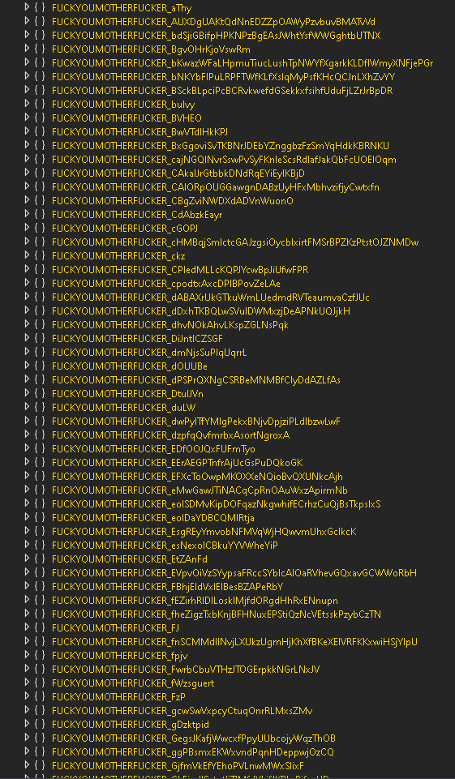
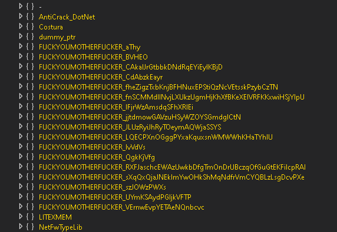

# Namespace-Cleaner
Removes unused/junk namespaces in obfuscated .NET programs to declutter and make reversing easier.

## Before and after on a SecureByte protected assembly.

<p align="center">
  
  
</p>

#

```
Usage: NamespaceCleaner <assembly-path>
```
